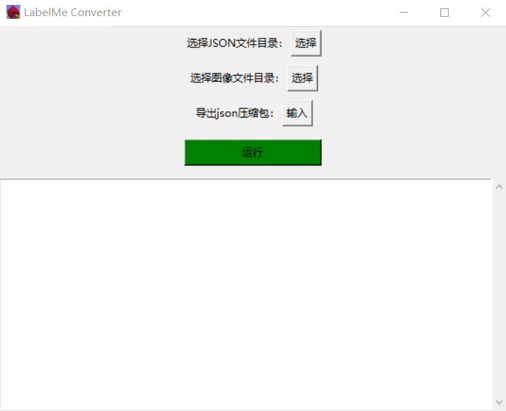
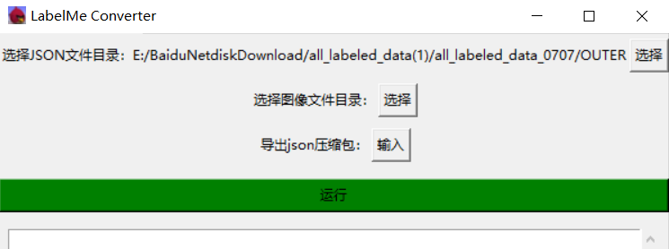
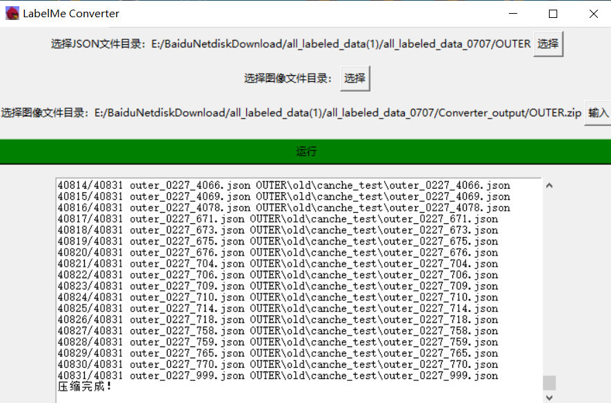
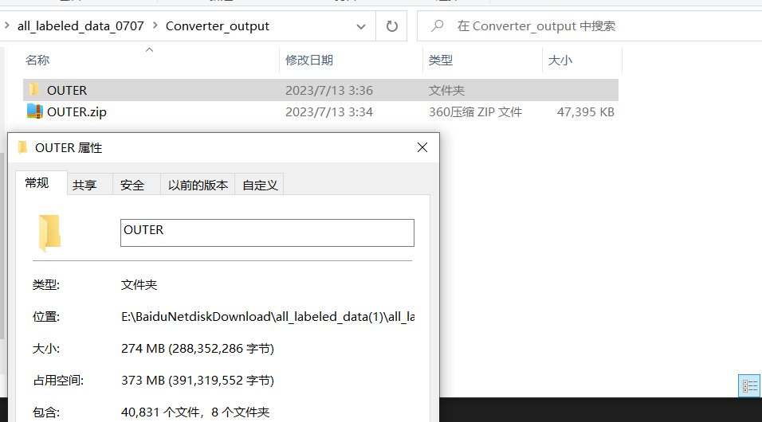
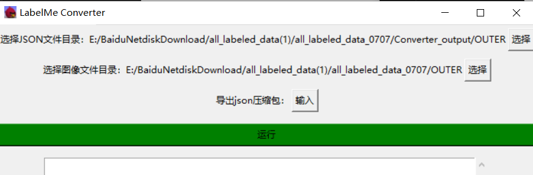
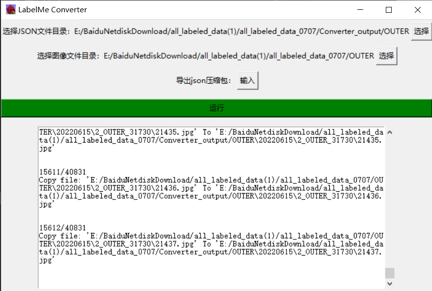

# 打包生成exe
```shell
# 打包命令: 
# pip install pyinstaller
pyinstaller --onefile --windowed --icon resources/icon.ico --add-data "resources/icon.ico;./resources/" Labelme-Converter.py

# exe文件输出在 ./dist 下
```

# Labelme-Convert 使用说明

- **软件功能**

  - 用来将成对的`jpg`,`json`格式的 labelme 标注文件拆分成独立的只包含标注信息的压缩包

  - 利用本软件选择图像目录和只含标注信息的json文件目录, 生成可供 labelme 软件查看的`jpg`,`json`文件

- **软件主页面**




## 1. 导出只含标注信息的 json 文件压缩包

**从labelme的标注文件夹中导出只含标注信息的 json 文件压缩包**

- 选择要导出的标注文件夹(点击第一个按钮)

  

- 导出json压缩包(点击第三个按钮, 选择保存路径)




## 2. 生成可供labelme查看的(json, jpg/jpeg)对

**从导出的只含标注信息的json压缩包中还原出labelme格式的标注文件对**

- 解压json压缩包, 下图是解压后的示例结果:

  

  

- 选择解压后的json文件夹(点击第一个按钮), 选择图片数据集的文件夹(点击第二个按钮)

  下图是示例选择的结果:

  

- 点击绿色按钮""运行", 等待转化完成...

  转换的结果示例, 如下图:

  

  

  

